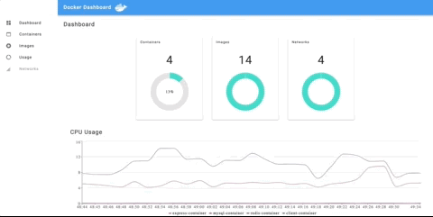
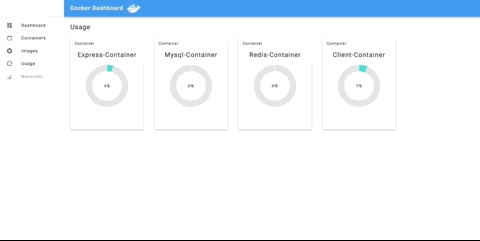
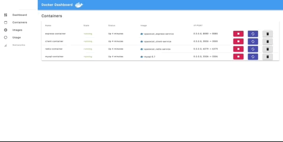

# Docker Dashboard

A simple, local web application serving your host machines Docker information

Features include:

-   Container, Image,and Network details



-   Live update of CPU Usage



-   Start/Stop/Restart/Remove Docker Containers



## Getting Started

To use this application, install this package globally

```bash
npm install --global docker-dashboard-app
```

Once the package is installed globally start the application by entering

```bash
docker-dashboard
```

The app should now be running at `http://localhost:8000`!

Open up your favorite browser to access the dashboard!
